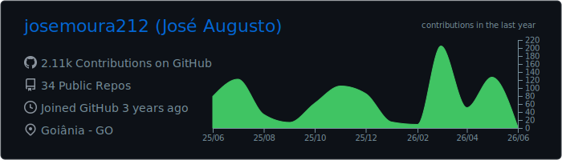
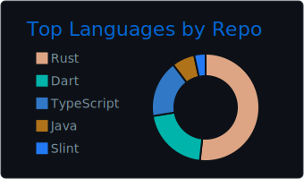
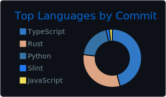
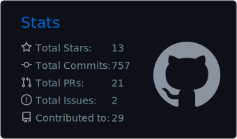
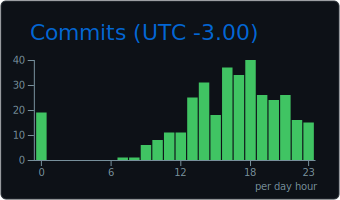

---

### Sobre mim

Dev Full-Stack / Mobile com foco em backend, infraestrutura e sistemas em tempo real. Trabalho com processamento assíncrono, mensageria e observabilidade no dia a dia.

🔧 Stack: **Node.js, Kafka, MongoDB, PostgreSQL, Redis, Docker**
🦀 Explorando **Rust** como linguagem backend (rdkafka, Axum, Actix)
📊 Observabilidade com **SigNoz + OpenTelemetry**
🐧 Manjaro Linux no dia a dia, Ubuntu nos servidores

### Redes Sociais

---

### GitHub Stats

  
  

### Profile Summary

  

  
  

  
  

---

### Tecnologias no dia a dia

### Estudando no momento

---

### Formação

**Software Developer** \
[**FullCycle**](https://fullcycle.com.br/) \
Tecnologias: `Docker`, `Kubernetes`, `Python`, `Next.js`, `Go`, `Kafka`, `RabbitMQ`
 [Grade completa](http://lancamento.fullcycle.com.br/brochura-fullcycle-3.0.pdf)  

**Software Developer** \
[**Academia Do Flutter**](https://novo.academiadoflutter.com.br/) \
Tecnologias: `Dart`, `Flutter`, `AWS`, `Firebase`, `Shelf`, `SQLite`
  

**Software Developer** \
[**B7Web**](https://b7web.com.br/) \
Tecnologias: `HTML`, `CSS`, `JavaScript`, `Node.js`, `Git/GitHub`
  

---

### Contribuições

